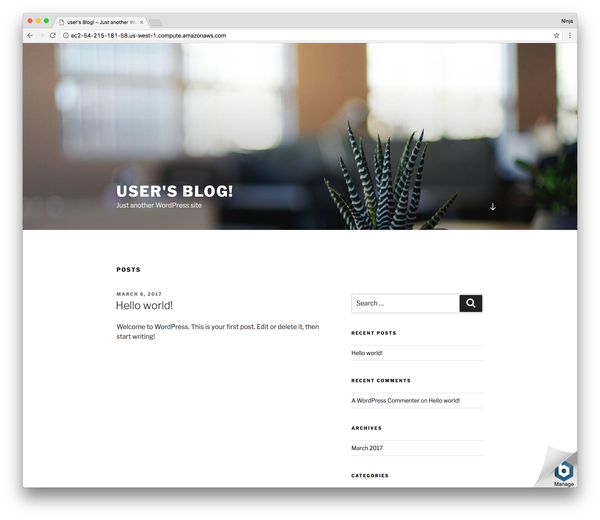
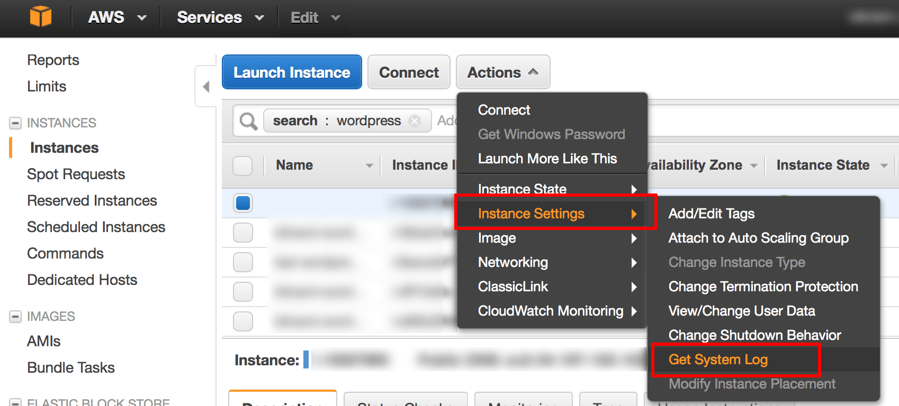

# Lab 1: WP is King

Did you know that roughly 80-90% of all the websites on the internet is powered by a single application? Yes, that's right! Most of the web is powered by a single open source project, and it's not even written in Java, C or Node. It's a PHP-based WordPress. So let's build you a personal blog by deploying AMI with WordPress, MySQL and Apache.

# Task

* Have WordPress website working and accessible to the entire world via public AWS DNS.

# Walk-Through

If you would like to attempt the task, go skip the walk-through and go for the task directly. However, if you need a little bit more hand holding or you would like to look up some of the commands or code or settings, then follow the walk-through.

## 1. Create an EC2 Instance

Log in to the web console and navigate to the EC2 dashboard. Select "Launch instance" to start the wizard. On the first screen of the instance wizard, find the Marketplace and select the image which has a free WordPress installation already built in. We recommend using *"WordPress powered by Bitnami"* because it's a free software image. Developers pay only for the AWS EC2 service.

On the next screen *Choose an instance type*, select "t2.micro" (Free tier eligible). Leave screens 3 and 4 with the default settings. Add tag named role with value "aws-course" on screen 5. Configure security group to have these ports open:

* HTTP 80
* HTTPS 443
* SSH 22

## 2. Test website

Copy the public URL for the newly created EC2 instance. You'll see the default home page as shown below.



## 3. Add a page (Bonus)

Get password from the EC2 instance logs. It'll be generated and displayed in the logs upon launch. You should change the password after the first log in.

To view the logs, connect to the instance via SSH and execute:

```
sudo cat /var/log/boot.log
```

The output will have something similar to this:

```
#########################################################################
#                                                                       #
#        Setting Bitnami application password to 'muPQWWfdsD1C'         #
#                                                                       #
#########################################################################
```

Alternatively, you can look up the password from the EC2 web console. Navigate to the "Get System Log" through the following:

1. Log in to the AWS web console and go to EC2 dashboard.
1. From the left sidebar navigation menu, select the "Instances -> Instances"
1. Locate your newly created WordPress instance and select it with the blue square.
1. From the "Actions" drop-down menu, select the "Instance Settings" | "Get System Log" option as shown below.

If you need more info, check out [this page](https://docs.bitnami.com/aws/faq/#how-to-find-application-credentials).



Log in to your newly create WordPress app by using "user" as username and password at "{PUBLIC_URL}/wp-admin" where PUBLIC_URL is the public URL of your instance.

Once in the WordPress admin dashboard, select Posts | "Add New". Enter title and text, then select "Publish" from the right top menu. You should see your new post live.
